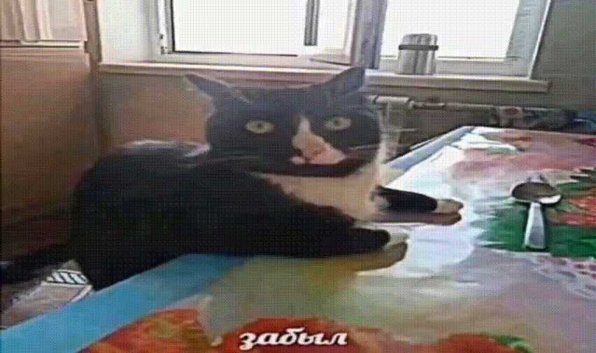

# Лабораторная работа №1
### Кто я?
Завадский Никита Валерьевич из группы 6405-010302D

### Научный руководитель
Логанова Лилия Владимировна

### Цитата
К сожалению, я особо не разбираюсь в философах. Однако философами моего детства стали смешарики: 

> Бывают вещи, с которыми очень трудно расстаться. Они уже такие старые, что их давно пора выбросить. Но к ним так привыкаешь, с ними связано столько историй, что кажется выбросить их все равно, что выбросить себя.
>
> *Серия "Биография зонтика" - голос за кадром*

---
